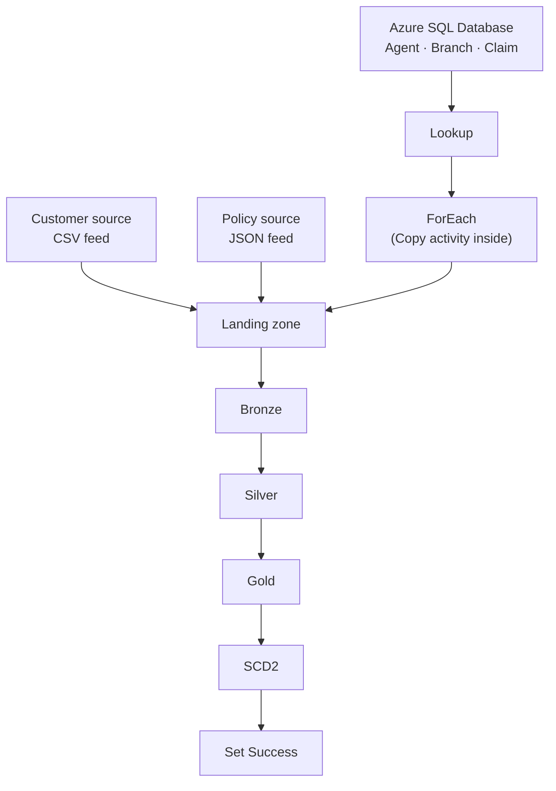

# Metadata-Driven-Insurance-Data-Platform
# Enterprise Insurance Data Pipeline

A metadata-driven Lakehouse pipeline on Azure Databricks that ingests
insurance data from heterogeneous sources, moves it through a Bronze /
Silver / Gold medallion architecture, and maintains full Slowly Changing
Dimension (SCD Type 2) history — all through **four generic notebooks**
instead of one notebook per source table.


---

## Table of contents

- [Overview](#overview)
- [Architecture](#architecture)
- [Why metadata-driven](#why-metadata-driven)
- [Load strategy: FULL vs. INCREMENTAL](#load-strategy-full-vs-incremental)
- [Notebooks](#notebooks)
- [Repository structure](#repository-structure)
- [Data quality and observability](#data-quality-and-observability)
- [Engineering challenges solved](#engineering-challenges-solved)
- [Getting started](#getting-started)
- [Roadmap](#roadmap)

---

## Overview

This project ingests five insurance entities — **Agent, Branch, Claim,
Customer, and Policy** — from two different kinds of source systems into a
single governed Lakehouse, then reshapes that data into an
analytics-ready dimensional model with full historical change tracking.

What makes this project worth a second look isn't the five tables — it's
that the pipeline was built to scale to any number of tables **without
growing in code size**. Every layer is driven by a single metadata control
table (`bronze_config`); adding a new source table is a config-table insert,
not a new notebook.

| | |
|---|---|
| **Catalog** | `dbw_insurance` (Unity Catalog, ACL-protected) |
| **Layers** | `insurance_bronze` → `insurance_silver` → `insurance_gold` |
| **Orchestration** | Azure Data Factory, one parameterized pipeline |
| **Compute** | Databricks notebooks (PySpark / Delta Lake) |
| **History tracking** | SCD Type 2 on Agent, Branch, and Customer |

---

## Architecture



The Azure SQL source is pulled via an ADF **Lookup** activity (reads the
active table list straight out of `bronze_config`) feeding a **ForEach**
loop with a **Copy** activity inside it, one iteration per table. Customer
and Policy arrive independently as CSV and JSON feeds. All three converge
in a common landing zone, after which the same ADF pipeline runs the
Bronze, Silver, Gold, and SCD2 notebooks in sequence and closes with a
**Set Success** activity.

Full breakdown of every stage, table, and column lives in
[`architecture.md`](./architecture.md).

---

## Why metadata-driven

None of the four loader notebooks contain table-specific logic. Each one
does the equivalent of:

```python
for config in metadata_rows:
    # same cleansing / validation / write logic for every table,
    # driven entirely by that row's config
```

`bronze_config` holds one row per table — source folder, file format,
primary key, load strategy, watermark column, target Gold/history table
names, SCD flag. Onboarding a new source table means **adding a row**, not
writing or copying a notebook. Five tables today, fifty next year — the
same four notebooks handle it unchanged.

---

## Load strategy: FULL vs. INCREMENTAL

| Table | Strategy | Watermark column | SCD2 tracked |
|---|---|---|---|
| Agent | FULL | `create_timestamp` | ✅ |
| Branch | FULL | `updated_at` | ✅ |
| Claim | INCREMENTAL | `LastUpdatedTimeStamp` | — |
| Customer | INCREMENTAL | `registration_date` | ✅ |
| Policy | FULL | `created_at` | — |

**FULL** tables are completely reloaded and overwritten every run — simple
and always internally consistent, used where reprocessing the full dataset
each time is cheap enough.

**INCREMENTAL** tables only pull rows newer than the last recorded
watermark (tracked in a `pipeline_watermark` control table), and are
appended rather than overwritten — used for tables that grow continuously
(claims accrue, the customer base grows) where reprocessing full history
every run doesn't make sense.

---

## Notebooks

| Notebook | Responsibility |
|---|---|
| `00_Configuration` | Catalog / schema / landing-path constants, shared by every notebook via `%run` |
| `01_Utility_Functions` | `add_metadata()`, `write_audit()`, duplicate/null-count helpers |
| `Enterprise_Generic_Bronze_Loader_v4` | Raw ingest, FULL/INCREMENTAL branching, watermark management, per-table audit logging |
| `Enterprise_Generic_Silver_Loader_v4` | Generic cleansing, standardization, business validation, metadata tagging |
| `Enterprise_Generic_Gold_Loader_v4` | Dimensional modeling — `dim_*` and `fact_*` tables |
| `Enterprise_Generic_SCD2_Loader_v4` | Change-history tracking for SCD2-enabled dimensions |

---

## Repository structure

```
├── Notebooks/
│   └── 00_Configuration
├── framework/
│   └── 01_Utility_Functions
├── loaders/
│   ├── Enterprise_Generic_Bronze_Loader_v4
│   ├── Enterprise_Generic_Silver_Loader_v4
│   ├── Enterprise_Generic_Gold_Loader_v4
│   └── Enterprise_Generic_SCD2_Loader_v4
├── architecture.md
└── README.md
```

*(Adjust paths above to match your actual repo layout before committing.)*

---

## Data quality and observability

- **Per-table fault isolation** — every table is processed inside its own
  `try/except` within each loader's loop, so one bad file or one schema
  mismatch never takes down the other tables in the same run.
- **Full audit trail** — every table's read/write counts, status, and any
  error message are logged to a dedicated audit table per
  `pipeline_run_id`, giving a queryable record of exactly what happened on
  every run, for every layer.
- **No silent schema drift** — Unity Catalog Table ACLs are enabled, which
  disables Delta's automatic schema merge. Any mismatch between incoming
  data and a table's committed schema fails loudly and immediately instead
  of corrupting the table quietly. This is a deliberate design choice, not
  a limitation — see below.

---

## Engineering challenges solved

A few real production issues surfaced and were resolved during hardening —
worth knowing if you're extending this pipeline:

- **Notebook cell-scoping bug (Silver).** Per-table logic had been split
  across notebook cells during iterative editing, so only the last table in
  the loop was ever actually written to Silver. Fixed by consolidating all
  transformation logic back inside the single `for` loop.
- **Timestamp parsing under ANSI mode (Bronze).** A watermark column with a
  non-standard date format (`dd-MM-yyyy HH:mm`) caused `to_timestamp()` to
  throw rather than return null, hard-failing incremental loads. Fixed with
  a tolerant multi-format parser that never raises, and logs a warning for
  any row it genuinely can't parse.
- **CSV schema inference drift (Bronze).** `inferSchema` has no memory
  across batches — a batch with no decimal values in a numeric column can
  get inferred as a narrower type than the committed Delta schema, and
  fail the append. Fixed generically by reconciling every incoming column's
  type against the existing table's schema before every write, for every
  table.
- **Stale history-table schema (SCD2).** A history table created under an
  earlier metadata-column naming convention no longer matched current Gold
  schema. Resolved as a deliberate one-time rebuild rather than a blind
  schema merge, preserving the fail-loud guarantee described above.

---

## Getting started

1. Import the notebooks into your Databricks workspace, preserving the
   folder structure (`Notebooks/`, `framework/`, loaders at the root or in
   their own folder).
2. Populate `bronze_config` and `pipeline_watermark` in your metadata
   schema.
3. Trigger the ADF pipeline (or run each notebook manually with a
   `pipeline_run_id` widget value) in order: Bronze → Silver → Gold → SCD2.
4. Query the audit table for that `pipeline_run_id` to confirm every table
   succeeded.

---

## Roadmap

- [ ] Logic Apps alerting on pipeline failure
- [ ] Power BI reporting layer on top of Gold
- [ ] CI/CD for notebook deployment

---

For the full architectural deep dive — every ADF activity, every table's
column-level detail, and the complete engineering changelog — see
[`architecture.md`](./architecture.md).README.md 
